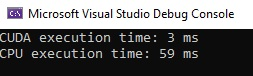

# ImageProcessingCuda

This project demonstrates parallel image processing using CUDA to accelerate the filtering and transformation of large images. The goal is to achieve a 5x performance improvement over the CPU-based solution by optimizing kernel execution and memory management.

## Features

- GPU-based Gaussian blur filter
- Performance comparison with CPU-based implementation
- OpenCV integration for image handling

## Requirements

- CUDA 12.5
- Visual Studio 2022
- OpenCV 4.5.0

## Performance

The CUDA-based Gaussian blur significantly reduces processing time compared to the CPU-based implementation. Execution times are measured and printed in the console output.
